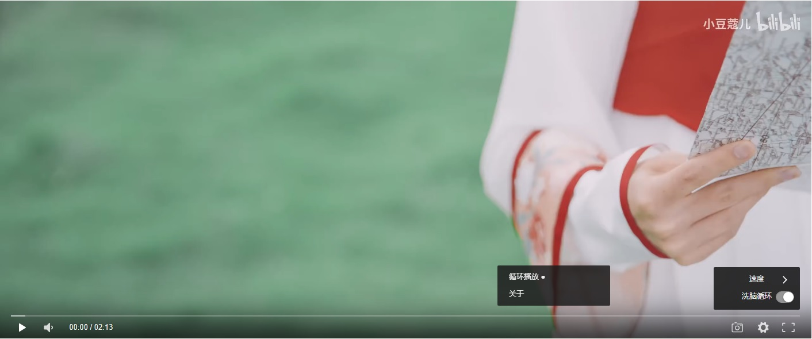

<h1 align="center">DPlayer</h1>

> ref [DPlayer](https://github.com/DIYgod/DPlayer) for detail

## Author

**DPlayer** © [DIYgod](https://github.com/DIYgod), Released under the [MIT](./LICENSE) License. 
Authored and maintained by DIYgod with help from contributors ([list](https://github.com/DIYgod/DPlayer/contributors)).

> [Blog](https://diygod.me) · GitHub [@DIYgod](https://github.com/DIYgod) · Twitter [@DIYgod](https://twitter.com/DIYgod) · Telegram Channel [@awesomeDIYgod](https://t.me/awesomeDIYgod)

### changes    

 1. a youtube like loop button  
   
 2. a new info panel
  

